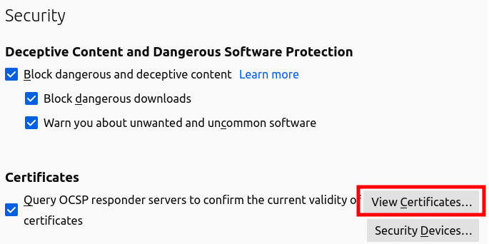
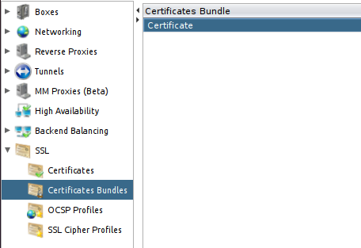

Installing X509 certificates on clients and CA on the WAF
=========================================================

* 1 [Presentation](#presentation)
* 2 [Creating the X509 certificate](#creating-the-x509-certificate)
	* 2.1 [Generating a private key for the user](#generating-a-private-key-for-the-user)
	* 2.2 [Generating a Certificate Signing Request for the user](#generating-a-certificate-signing-request-for-the-user)
	* 2.3 [Purchasing the certificate from the CA](#purchasing-the-certificate-from-the-ca)
	* 2.4 [Generating a PKCS#12 certificate](#generating-a-pkcs12-certificate)
* 3 [Integrating the PKCS#12 certificate into the browser](#integrating-the-pkcs12-certificate-into-the-browser)
* 4 [Installing public CA certificate into the WAF](#installing-public-ca-certificate-into-the-waf)

Presentation
------------

This use case will show you how to create a x509 certificate and install it in your browser to authenticate with it, and how to install the public CA certificates in the WAF.

Creating the X509 certificate
-----------------------------

Tools such as OpenSSL, Java Keytool, Cigwin, and others can generate private key, CSR and PKCS#12 files. OpenSSL will be used in the following examples.

### Generating a private key for the user

First of all, we are going to create a private key for the user with the following command: 

```
openssl genrsa -out <file_rsa.key> 2048
```

It will generate an RSA private key of **2048 bits** in the **<file_rsa.key>**, which will be used to generate the CSR. You will get a file containing the private key.
**Make sure to backup this file**, if you loose the key and have to create a new one, the certificate will be invalid. 

And make the file unreadable by the other users using the following command: 
```
chmod 400 <file_rsa.key>
```

### Generating a Certificate Signing Request for the user

Then, we need to generate a CSR (Certificate Signing Request) file to create a valid certificate for the user. To do so, write the command:

```
openssl req -new -key <file_rsa.key> -out <file_rsa.csr>
```
The prompt will ask a serie of questions, and the responses will be included in the final certificate. The important one is the **Common Name**, it must contain the complete name of the user to secure. It will generate a CSR in the **<file_rsa.csr>** file, which will be used to generate the X509 certificate.

### Purchasing the certificate from the CA

On Verisign (or other CA), choose a certificate type, fill in the personal information, and indicate the platform.

Next, paste the content of the CSR file generated in the previous stage. Open the file with a basic editor and paste the entirety of the CSR into the field of the Verisign form. Once pasted, check the validity of the extracted information, in particular the domain name. Provide a challenge passphrase as requested.

Once the command is entered you will obtain the final certificate.

### Generating a PKCS#12 certificate

Finally, we will create a PKCS#12 certificate, that consists in a file format used to store a private key with the associated X509 certificate.

Use the following command: 
```
openssl pkcs12 -export -out <file_pkcs12_cert.pfx> -inkey <file_rsa.key> -in <file_cert.crt>
```

It will create the PKCS#12 file **<file_pkcs12_cert.pfx>**.

Integrating the PKCS#12 certificate into the browser
----------------------------------------------------

This file will have to be added in the browser to allow the user authentication.

Below is the procedure for importing this certificate into **Mozilla Firefox**.

* Go to **Preferences > Privacy & Security** or type `about:preferences#privacy` in the **Address Bar**.
* Scroll down to **Security** part and click on **View Certificates** in **Certificates** section.



* Go to **Your Certificates** tab, press **Import** and select the previously created **<file_pkcs12_cert.pfx>**.


Installing public CA certificate into the WAF
---------------------------------------------

Recover **public key certificates** of the CA and the sub-CAs on their support sites. To upload them to the WAF: 
* Go to **Setup > SSL > Certificates Bundles**.
* Click on the **Certificates Bundle** and create a new bundle or open a bundle already used by our tunnel. 



* On the **Certificates Authorities** tab below, press **Upload** and select public key certificate file.


The Certificate Bundle can now be linked to the HTTPS tunnel. Go to SSL tab, enable **Verify client certificate** and in the **CA/CRL Certificates** option, select the Certificate Bundle where the public key certificate has been uploaded.

To finish, apply the tunnel and try to connect to the tunnel with the browser using the pkcs12 file. The WAF will verify it against the public key certificate and validate the authentication.