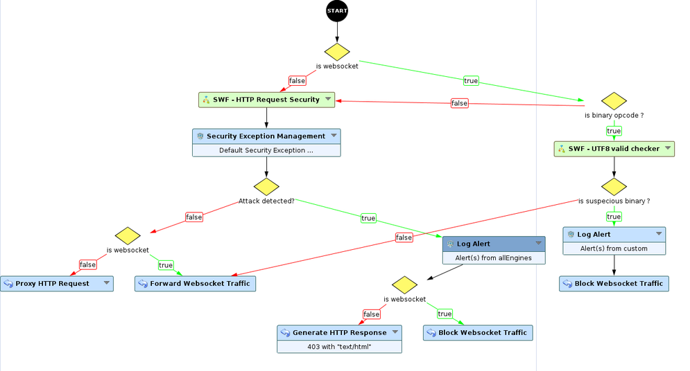
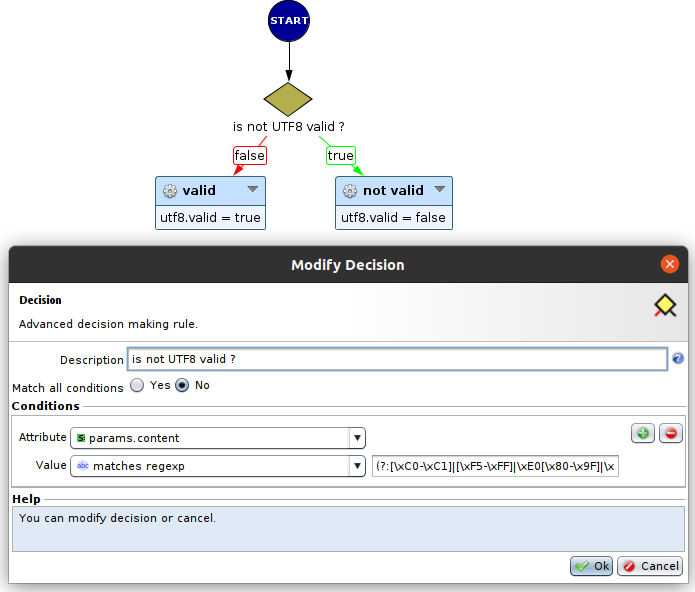

# Block the Binary-based Websocket using UTF-8 validation

* 1 [Presentation](#presentation)
* 2 [How to Block the Binary-based Websocket using the SWF UTF-8 valid checker](#how-to-block-the-binary-based-websocket-using-the-swf-utf-8-valid-checker)
* 3 [SWF Block Websocket Binary Based on a Regexp](#swf-block-websocket-binary-based-on-a-regexp)
* 4 [Backup](#backup)


# Presentation
With version 6.9.0 of the WAF, we can filter, detect and block attacks injected into `Websocket` _text_ frames.
>Note: to handle `Websocket` _text_ frames we can use the new `HTTP-Websocket` default workflow. 

However _binary_ frames are not handled by the WAF. Therefore the latter doesn't have any control over what is transmitted as `Websocket` _binary_ data.

To overcome this issue, we already created a use case that blocks all the _binary_ frames by exploiting their `opcode` header value, see [Block Websocket Binary Opcode](../Block_Websocket_Binary_Opcode).<br/>
However, this solution can be very strict and prevent stream data (video, image, etc) to be exchanged.
For that reason, in addition to the check of the `opcode` we need to verify<br/>
if the data in text form like (`utf-8`). If we detect a text form, it will be considered as
suspicious because it should not contain binary data, thus will be blocked. Stream form (`stream`) will be forwarded.

# How to Block the Binary-based Websocket using the SWF UTF-8 valid checker 
The following Figure explains the main operating principle:

.

As explained in the schema, first we need to check the `Websocket` frame `opcode`, if it is _binary_ frame, then using the `SWF UTF-8 valid checker`, we check the frame content (see the section below). 

If the `SWF UTF-8 valid checker` returns `true` this means that the content is suspicious, thus we trigger a `Log Alert` and we `Block Websocket Traffic`. <br/>
Otherwise, if the `SWF UTF-8 valid checker` returns `false`, then we `Forward Websocket Traffic`.

This is an example of the captured log alert after the detection of a text form binary frame:


# SWF Block Websocket Binary Based on a Regexp

The following schema depicts the proposed `SWF UTF-8 valid checker`.



The sub-workflow uses a regexp that detects all the non-valid UTF-8 characters. We exploit that to make the difference between the stream binary and the text-like binary frames.

This is the used regexp for detecting invalid UTF-8 content:
```
(?:[\xC0-\xC1]|[\xF5-\xFF]|\xE0[\x80-\x9F]|\xF0[\x80-\x8F]|[\xC2-\xDF](?![\x80-\xBF])|[\xE0-\xEF](?![\x80-\xBF]{2})|[\xF0-\xF4](?![\x80-\xBF]{3})|(?<=[\x00-\x7F\xF5-\xFF])[\x80-\xBF]|(?<![\xC2-\xDF]|[\xE0-\xEF]|[\xE0-\xEF][\x80-\xBF]|[\xF0-\xF4]|[\xF0-\xF4][\x80-\xBF]|[\xF0-\xF4][\x80-\xBF]{2})[\x80-\xBF]|(?<=[\xE0-\xEF])[\x80-\xBF](?![\x80-\xBF])|(?<=[\xF0-\xF4])[\x80-\xBF](?![\x80-\xBF]{2})|(?<=[\xF0-\xF4][\x80-\xBF])[\x80-\xBF](?![\x80-\xBF]))
```

When the frame content is not UTF-8 valid then we set the provided `utf8.valid` attribute with `false` else with `true`. 

# Backup
The sub-Workflow that allows you to check if the content is UTF-8 valid or not can be downloaded here: [SWF - UTF8 valid checker.backup](./backup/SWF%20-%20UTF8%20valid%20checker.backup).
