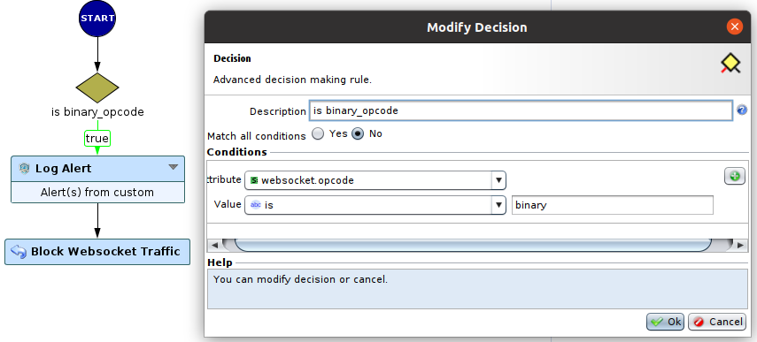
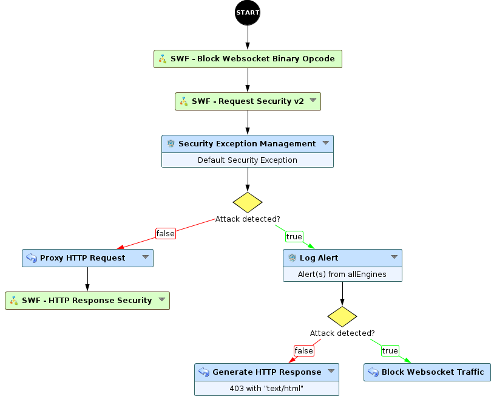

# Extract information on excepted requests

* 1 [Presentation](#presentation)
* 2 [SWF - Block Websocket Binary Opcode](#swf-block-websocket-binary-opcode)
* 3 [Backup](#backup)

# Presentation
With version 6.9.0 of the WAF, we can filter, detect and block attacks injected into `Websocket` _text_ frames.
>Note: to handle `Websocket` _text_ frames we can use the new `HTTP-Websocket` default workflow. 

However _binary_ frames are not handled by the WAF. Therefore the latter doesn't have any control on what is transmitted as `Websocket` _binary_ data.

To overcome this issue, this use-case is created to block all the _binary_ frames by exploiting their `Opcode` header value. 

# SWF Block Websocket Binary Opcode
Each `Websocket` frame has a header called the `opcode`, the latter can have the following values: 
* 0x01 denotes a _text_ frame
* 0x02 denotes a _binary_ frame
  
Based on the `Opcode` we detect the _binary_ frame, we log this information and we block the _binary_ frame.

The following schema depicts the proposed sub-workflow of this use-case, it is called `SWF Block Websocket Binary Opcode`.

As shown by the picture above, when `websocket.opcode` is equal to `binary` we trigger a `true` and then we log and block the frame using `Log Alert` and `Block Websocket Traffic` nodes respectively.

In the following, we made an example based on the new `HTTP-Websocket` default workflow template. We placed the `SWF - Block Websocket Binary Opcode`  
between the `START` node and the `SWF - Request Security v2`. See the picture:

Finally, when a _binary_ frame is sent, we stock and log its event and we block the frame: 

# Backup
The sub-Workflow can be downloaded here: [SWF - Block Websocket Binary Opcode](./backup/SWF%20-%20Block%20Websocket%20Binary%20Opcode.backup).
