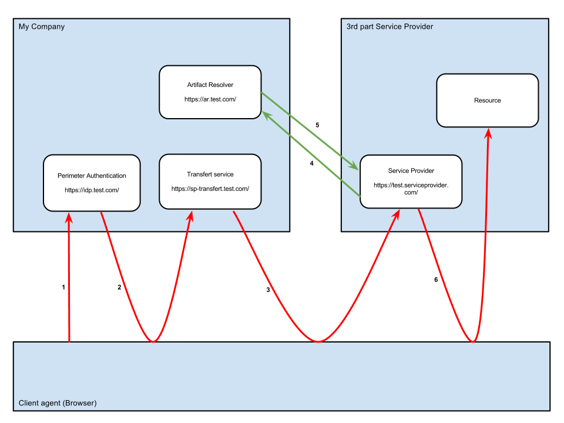
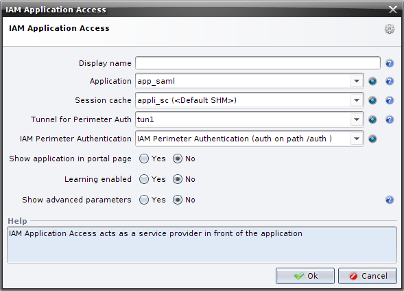
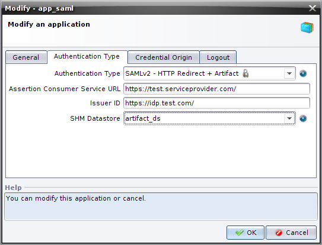
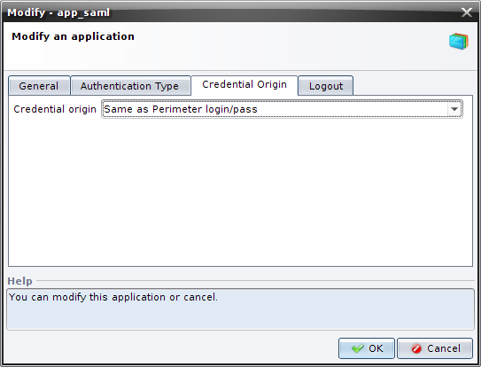
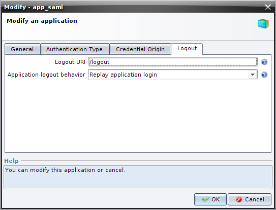
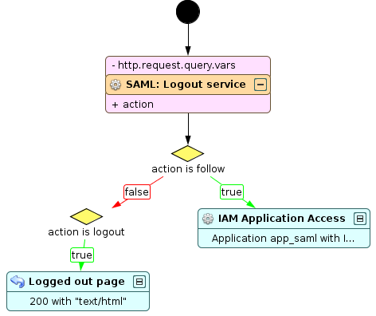
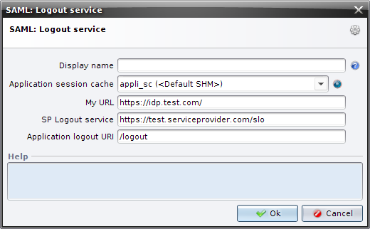
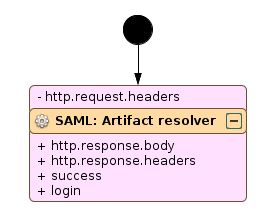
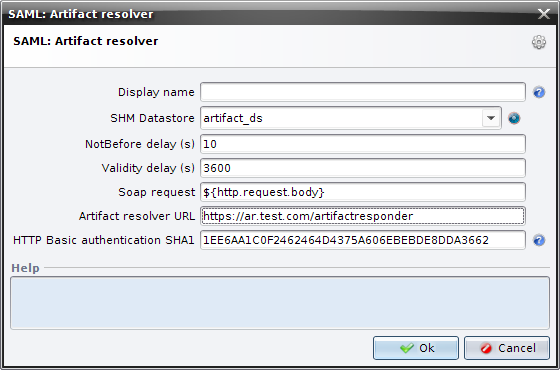

# Connecting to a SAMLv2 Service Provider

This use case requires the backups provided on [SAML pack 2.0.1.backup](./SAML-pack-2.0.1.backup).

## Goal

Thanks to the advanced Workflow functionalities, and in particular the XML processing nodes (parsing, signing, etc.), the WAAP is capable of integrating into a variety of SAML ecosystems. This documentation describes one of the interconnection possibilities – the WebSSO profile with HTTP Redirect binding + Artifact. In this implementation, the WAAP will represent the Identity Provider (IdP) and the remote site will represent the Service Provider (SP).

This documentation describes the configuration of the following components:

*   **Transfer Service**: This component generates a Redirect to the Service Provider in the expected format (that is, a Redirect with artifact).
*   **Artifact Resolver**: This service responds to requests for recovering user attributes from the Service Provider.
*   **Perimeter Authentication**: This is the component that handles authentication of the user (with the company directory, for example), implemented by the [WAM Perimeter Authentication](WAM-Perimeter-Authentication.md) node. This configuration is not dealt with in this document.

## Details of interactions

1.  Authentication with the **Perimeter Authentication** service. This stage can be broken down into several round trips, depending on the configuration chosen. Note also that if the user attempts to access the **Transfer Service** directly, s/he will be redirected to the **Perimeter Authentication** service and return to Stage 1.
2.  Once authenticated, the **Perimeter Authentication** service redirects the user to the **Transfer** **Service** using an auto-submit form.
3.  The **Transfer Service** component recovers the user’s profile from the **Perimeter Authentication** service (flow not shown), stores the user’s attributes (in practice only the login) in memory, then generates an Artifact that it places as a parameter in the Redirect URL to the **Service Provider**.
4.  The **Artifact Resolver** service recovers the user’s attributes, that were stored in Stage 3, from the Artifact sent by the **Service Provider**. Then it formats a SOAP ArtifactResponse response containing the user’s attributes, signs it with the signing key, then sends it back to the **Service Provider**.
5.  The **Service Provider** receives the SOAP message containing the SAML message containing the user’s attributes, verifies the message signature, and then connects the user to the requested resource.

## Prerequisites

A minimum WebSSO configuration must be in place on the WAAP. That is, at least one Tunnel must be configured with a Workflow containing an **“[WAM Perimeter Authentication](WAM-Perimeter-Authentication.md)”** node. The node must be configured with a Perimeter Gate (the choice of the type of perimeter authentication is free and is not part of the SAMLv2 specification). This tunnel represents the **Perimeter Authentication** service.

Note about the use of HTTPS

The use of HTTPS on the different flows is not compulsory from the point of view of SAML. However it is strongly recommended. In the preceding diagram, the critical flows are 1, 4, and 5 because they contain user information that can be confidential.

The certificates used for the HTTPS part (configured at the level of the Tunnel) are not related to the certificates used for the XML signing part. Therefore they can be distinct from them.

## Including preconfigured nodes

The backups provided on [this page](http://documentation.denyall.com/display/ubikawaap611en/SAML) contains the different elements to be restored onto the WAAP.

The different elements used for this page are:

*   **Sample: SAMLv2 IdP Binding HTTP Redirect + Artifact**: main Workflow of **Identify Provider**.
*   **SAML**: Artifact generator: basic node for creating standardized SAML artifact identifiers. This node is used in the “Sample: SAMLv2 IdP Binding HTTP Redirect + Artifact” sub-Workflow.
*   **SAMLv2 - HTTP Redirect + Artifact**: a sub-Workflow of the “Application Authentication” type which provides a means of application authentication for WAM Application objects. This is the component used for the **Transfer Service**.
*   **SAML: Artifact resolver**: a sub-Workflow that implements the **Artifact** **Resolver** service.
*   **SAMLv2\_HTTP\_Redirect\_Artifact\_SP\_emulator**: a sub-Workflow representing a fictional **Service Provider** used to validate the configuration
*   **SAML: Logout service**: sub-Workflow that implements logout functionalities
*   **SAMLv2 namespaces**: Contains the Declaration of the XML Namespaces used, which allows you to operate with XML messages that use different namespaces. This element is used when parsing XML messages received by the **Artifact Resolver**.
*   **SAML\_KEYSTORE**: Contains a set of x509 keys used for signature verification and signing XML messages. A test key is included in this component, but will have to be replaced by a final key.

## Adding the signing key

A key is necessary for signing the responses of artifacts returned to the Service Provider so that it can confirm that the message is original. For that, the private key, generally having a .key ou .pem extension, accompanied by the public key (generally having a .crt ou .pem extension) must be added in the Keystore (**“Management”** panel), named **Sample: SAML keystore**. The key already present can be deleted, since it is given only as an example.

The public key derived from this private key will have to be sent to the Service Provider, generally via a Metadata file.

if the signing key is modified, the new key and possibly a certification string will have to be sent to the **Service Provider**. 

## The Transfer Service

An Application representing the Transfer Service to the Service Provider is provided in the backup. Perform the following operations to create an equivalent one:

1.  Create an **SHM Datastore** object (we’ll call it **artifact\_ds**). The default settings will work in most cases. It will serve to store the identifiers of authenticated users and exchange these data between the Transfer Service and the **Artifact Resolver**. It will be used exclusively by the transfer WAM application and the **Artifact Resolver** service.

3\. Create an application configuration. The authentication type you choose must be the one that was imported earlier (SAMLv2 - HTTP Redirect + Artifact).  
  

**“**Assertion **Consumer Service URL”** designates the URL of the Service Provider to which the user will be redirected. **“Issuer ID”** is the identifier of our **Perimeter Authentication** service; it’s the same value we’ll find in the metadata under the **entityID** attribute. The **“SHM Datastore”** parameter must set to an SHM-type Datastore configuration.

Take care that **“Application Logout behavior”** is set to **“Replay application login”**.

4\. Add the “SAML: Logout service” node upstream of the **“WAM Application Access”** node.

This node runs on top of the normal operation of the SSO logout. Therefore output from the node has to be managed as a function of the **“action”** string-type attribute that is generated – equal to **“follow”** when the request has to be sent to the **“WAM Application Access”** node, and **“logout”** during the final logout phase.

## “Artifact Resolver” service

We use a single Workflow and Tunnel for the different components, but it’s also possible to separate the components on several Tunnels and Workflows.  
 

*   **SHM Datastore**: Specify the same Datastore created and used for the Transfer Service (artifact\_ds).
*   **NotBefore delay (s):** the number of seconds before the date of access to the transfer application for validity of the artifact. This can compensate for any clock desynchronization. Default is 10 seconds.
*   **Validity delay (s)**: the number of seconds after the date of access to the transfer application before the proof of the user’s authenticity is considered to have expired. Default is 3600 seconds, or one hour.
*   **Soap request**: an expression representing the contents of the SOAP message that was received. Set to ${http.request.body} by default.
*   **Artifact resolver URL**: URL of the Artifact Resolution Service declared with the Service Provider.
*   **HTTP Basic authentication SHA1**: optional. If empty, the Service Provider accesses the Resolver without having to authenticate. If a value is set a request for authentication is made to the Service Provider in HTTP Basic. The value must be in the form: hex\_encode(sha1(“value of the expected Authorization header”)). Example: For "mylogin" / "mypass", the function is hex\_encode(sha1("mylogin:mypass")), and the resulting value to be entered is 205B337396E0430AC4F09281C93367D3A6A99722.

## Metadata

The Service Provider can require that a descriptor of the Identity Provider service be provided in a standardized metadata format. Here is an example of such a file.

The variable elements, which will need to be adapted, are:

*   **entityID**: the identifier of the IdP (that is, the WAAP), which must be identical to the **“Issuer ID”** parameter of the WAM application.
*   **dsig:X509Certificate**: X509 certificate enabling verification of the signings performed by the **Artifact Resolver** service. This is the public certificate, in PEM format, encoded in base 64.
*   **dsig:X509IssuerName:** the identifier of the certificate’s issuer.
*   **dsig:X509SerialNumber: serial number of the certificate**.
*   **dsig:X509SerialNumber:** the certificate’s serial number.
*   **dsig:X509SubjectName:** the identifier of the signing certificate.
*   **ArtifactResolutionService,** attribut **Location** : complete URL leading to the **Artifact Resolver** service.
*   **ArtifactResolutionService, Location** attribute: the complete URL for reaching the **Artifact Resolver** service.
*   **SingleLogoutService**, **Location** attribute: the complete URL for reaching the logout of the Transfer Service. This URL must correspond to the path specified in the **“Logout URI”** parameter of the WAM application and the Logout Service.
*   **SingleSignOnService**, **Location attribute**: the complete URL for reaching the **WAM Perimeter Authentication** node. **OrganizationName**: the identifier of the company.
*   **OrganizationURL**: the company’s main URL.
