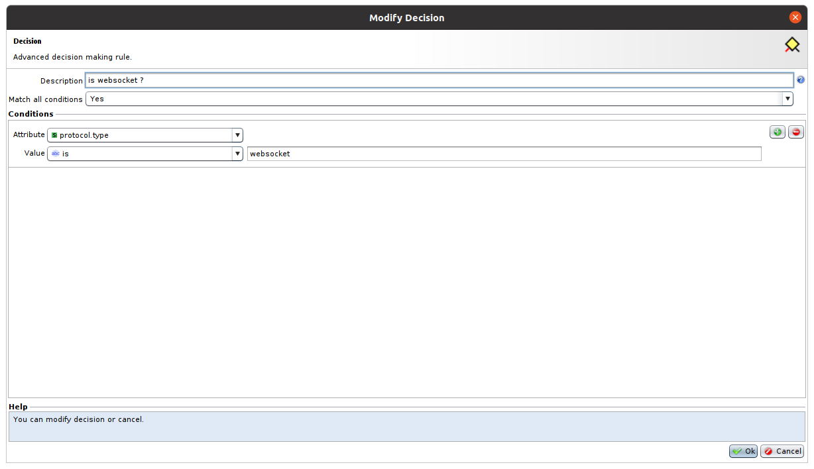
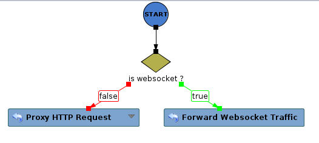
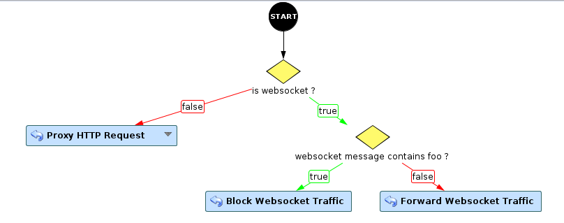
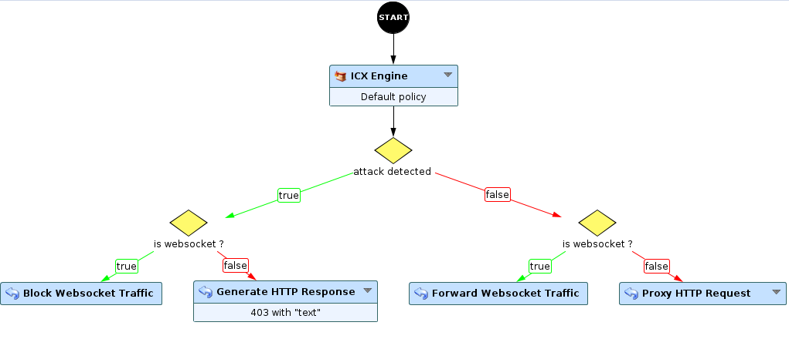
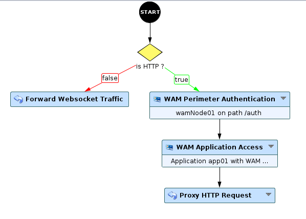
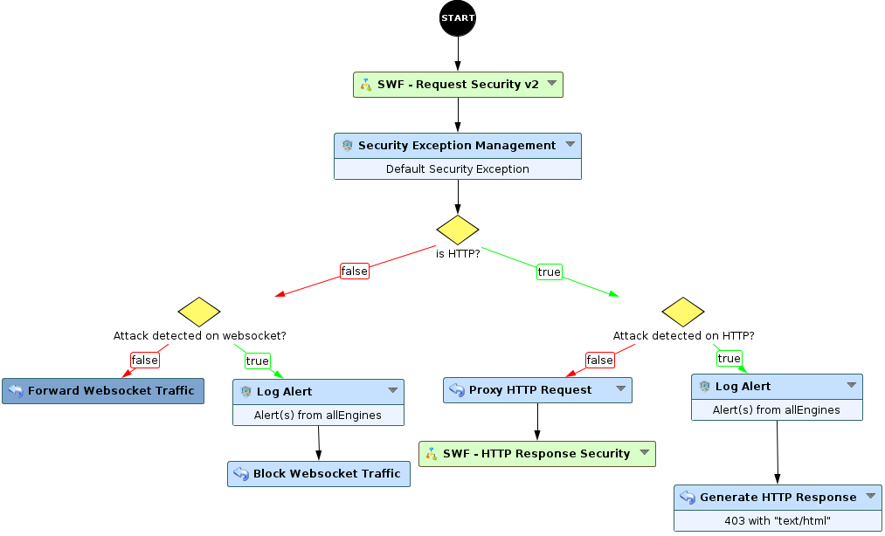
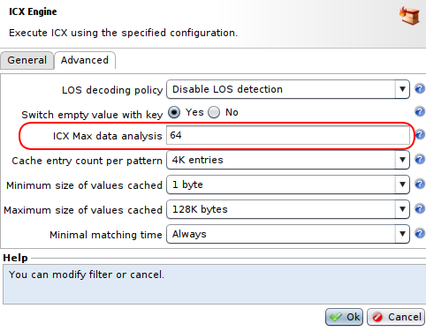

Websocket Securisation
================

* [1-Presentation](#presentation)
* [2-Backup](#backup)
* [3-Websocket Connection](#websocket-connection)
	* [3.1 Enable Websocket upgrade on tunnel](#enable-websocket-on-tunnel)
	* [3.2 What is the current data](#what-is-the-current-protocol-type)
* [4-Workflow](#workflow)
    * [4.1 Proxying HTTP and Websocket](#proxying-http-and-websocket)
    * [4.2 Websocket message](#websocket-message)
    * [4.3 Proxying Websocket Data](#proxying-websocket-data)
    * [4.4 Blocking Websocket Data](#blocking-websocket-data)
    * [4.5 ICX and Websocket](#icx-and-websocket)
    * [4.6 Websocket direction](#websocket-direction)
    * [4.7 WAM and Websocket](#wam-and-websocket)
    * [4.8 Real world scenario](#real-world-scenario)
* [5-Performance consideration](#workflow)
* [6-FAQ](#faq)
    * [6.1 Give me something ready to use](#give-me-something-ready-to-use)
    * [6.2 My tunnel does not process Websocket traffic, what happens?](#my-tunnel-does-not-process-websocket-traffic-what-happens)
    * [6.3 What node can I use on Websocket traffic?](#what-node-can-i-use-on-websocket-traffic)
    * [6.4 What node should not see Websocket traffic?](#what-node-should-not-see-websocket-traffic)
    * [6.5 Where are ping and pong Websocket frames?](#where-are-ping-and-pong-websocket-frames)
    * [6.6 Can I modify the Websocket message?](#can-i-modify-the-websocket-message)
    * [6.7 What is a Websocket compressed frame?](#what-is-a-websocket-compressed-frame)
    * [6.8 My Websocket data convey a protocol that is not known by the workflow](#my-websocket-data-convey-a-protocol-that-is-not-known-by-the-workflow)
    * [6.9 How the `close connection` option of Block Websocket Traffic works ?](#how-the-close-connection-option-of-block-websocket-traffic-works)

# Presentation

This use case introduces how to secure a Websocket connection.

We will focus on the mandatory parts in a workflow. It is complementary to the official documentation which goes into more technical details.

# Backup

You can download the backup here: [Websocket-Study](./backup/websocket_study.backup).

# Websocket Connection

### Enable Websocket on tunnel

First enable Websocket for the tunnel.

* Double click on the tunnel > Advanced.
* Select **Allow Websocket upgrade**

### What is the current procotol type

Websocket enabled tunnel handles both HTTP and Websocket traffic.

A new attribute provided by the start node **`protocol.type`** tells what is the current type of data the workflow is processing.

* for HTTP: the value of `protocol.type` is `HTTP`
* for Websocket: the value of `protocol type` is `websocket`

Use a decision node on this attribute to differentiate actions based on traffic type.

# Workflow

### Proxying HTTP and Websocket

Websocket protocol is established from a client to a backend via a specific HTTP Request, the **Websocket HTTP Upgrade Request**.

Consequently, a Websocket workflow must make sure that this request is proxied to the backend.

Remember, both Websocket and HTTP traffic use the same workflow. But only HTTP Traffic must be proxied using [HTTP Proxy Request](https://documentation.ubikasec.com/display/UBIKAWAAP69EN/Proxy+HTTP+Request) node.
(Websocket traffic must not go inside).

The opposite is also true. **[Forward Websocket Traffic](https://documentation.ubikasec.com/display/UBIKAWAAP69EN/Forward+Websocket+Traffic)** node must only process Websocket data.

It leads to this simpliest possible workflow for a tunnel handling Websocket connection with no security.

### Websocket Message

When the workflow is processing Websocket data, the start node provides an attribute **websocket.message** which can be inspected in decision node and use in **expression**.

The Websocket message is the payload part of the Websocket protocol. This payload is always presented ready to use, i.e unmasked if needed and inflated if it was compressed.

### Proxying Websocket data

**[Forward Websocket Traffic](https://documentation.ubikasec.com/display/UBIKAWAAP69EN/Forward+Websocket+Traffic)** node must be used to forward websocket message.

### Blocking Websocket data

Let's pretend that you want to block Websocket data if the message contains "foo".

Add a decision node that will check that.

If the message contains "foo", then use the **[Block Websocket Traffic](https://documentation.ubikasec.com/display/UBIKAWAAP69EN/Block+Websocket+Traffic)** node.

[Block Websocket Traffic](https://documentation.ubikasec.com/display/UBIKAWAAP69EN/Block+Websocket+Traffic) node has two options: 

* `drop message`: only the current Websocket message is not proxied. The Websocket connection between client and backend remains open.
* `close connection`: the Websocket connection is closed. (Behind the scene, a Websocket specific frame is sent to both client and backend).

Based on your application and your security appreciation, choose the relevant one. 

Some applications will continue to work fine if some data are "lost". (example: some real time data sent from backend to client that only display them).

Other applications would not support losing data. 

To summarize on this point: **drop message** is less drastic and has less performance impact than **close connection** but applications are not always ready for such behaviour. 

### ICX and websocket

To secure Websocket traffic, you can use **[ICX Engine](https://documentation.ubikasec.com/display/UBIKAWAAP69EN/ICX+Engine)** which supports dedicated rules for Websocket message.

ICX is an example of node that can be used indifferently on both traffic type. 

The new part on ICX policy is called **Websocket**. It will be applied against **websocket.message** value. 
It can be used on ICX Conditions as you use to do with other ICX part.

ICX Default policy has been upgraded to have rules for Websocket (since DSU 3.38).

We can therefore have a simple secured workflow: 

First: process data (whatever traffic type) in ICX. 

If no attack is detected, [HTTP Proxy Request](https://documentation.ubikasec.com/display/UBIKAWAAP69EN/Proxy+HTTP+Request) if data is an HTTP Request, [Forward Websocket Traffic](https://documentation.ubikasec.com/display/UBIKAWAAP69EN/Forward+Websocket+Traffic) if data is a Websocket frame.

If an attack is detected, [Generate HTTP Response](https://documentation.ubikasec.com/display/UBIKAWAAP69EN/Generate+HTTP+Response) if data is an HTTP Request, [Block Websocket Traffic](https://documentation.ubikasec.com/display/UBIKAWAAP69EN/Block+Websocket+Traffic) if data is a Websocket frame.

As ICX does not work on binary data, binary Websocket data are not processed by ICX Engine.

### Websocket direction

Websocket protocol is bidirectionnal. There is no such concept of  **Request** and **Response** as in HTTP. 

Both client and backend can spontaneously send Websocket frame.

Therefore the workflow acts differently when processing Websocket traffic than when processing HTTP traffic.

* HTTP Request (from Client to Backend) enters the workflow from the start node. 
* HTTP Response enters the workflow after the "Proxy HTTP Request" node (everything before is not processed on the response).
* Websocket frame always enters the workflow from the start node, independently of their origin.

The start node provides **"websocket.from"** attribute to differentiate the direction of the current Websocket frame.

* `websocket.from` = `client`: from client to backend
* `websocket.from` = `backend`: from backend to client

Let's pretend that you want to block Websocket data if the message contains "foo" **AND** it is a frame from backend to client

### WAM and Websocket

In case you are using WAM Application Gate, the websocket traffic should not go through it (websocket data won't be proxied if so). 

As a Websocket Connection can not be established without initial HTTP Request, it does not cause access security issue because it means that any websocket traffic has to go first through the HTTP authentication path of the workflow.

### Real world scenario

Which security engine should be applied on Websocket data depends on the application. 

If for example the Websocket data is always a JSON document, then the **json_to_table** node can be used to parse it and present to ICX (key,value) set.

What you should do is beyond the scope of this use case. 

Process as you are used to do with a traditional HTTP Application, except that it is actually simplier because the only thing to secure is websocket.message

We recommand to use the workflow **HTTP and Websocket** that will handle the case of Websocket containing plain text, JSON and XML.

# Performance Consideration

Websocket payload can be large. Very large data analysis can lead to performance issues. 

That's why by default [ICX Engine](https://documentation.ubikasec.com/display/UBIKAWAAP69EN/ICX+Engine) truncates data analysis to the first 64KB. 

It means that an attack occurring after 64KB of data is not detected. 

You can change this behaviour by setting the [ICX Engine](https://documentation.ubikasec.com/display/UBIKAWAAP69EN/ICX+Engine) parameter **ICX Max data analysis**.

A value of -1 means no truncation. 

Be also aware that the [JSON To Table](https://documentation.ubikasec.com/display/UBIKAWAAP69EN/JSON+To+Table) which is performing a JSON parsing to fill a table attribute can also lead to performance issues if it is activated on JSON files of several MB.

# FAQ

### Give me something ready to use

Use the workflow **HTTP and Websocket**.

### My tunnel does not process Websocket traffic, what happens ? 

Make sure you have [enable the websocket upgrade](#enable-websocket-on-tunnel).

Make sure the original HTTP Websocket Upgrade gets proxied via the Proxy HTTP Request.

### What node can I use on Websocket traffic ? 

Every node that are not performing operation related to HTTP Protocol.

| API Security | Description |
|:-------------|:-------------|
| JSON Attribute Get | Gets a JSON attribute entry |
| JSON Attribute Set | Sets a JSON attribute entry |
| JSON Attribute Unset |	Unsets a JSON attribute entry |
| JSON Schema Validation	| Validates a JSON document with a JSON schema |
| JSON To Table |	Parses JSON data and fill a table from its content |
| JWT Generate |	Generates JSON web token |
| JWT Parsing |	Parse a JSON web token to extract payload and header |
| XML Decrypt |	Decrypt a XML document |
| XML Encrypt |	Encrypt a XML document |
| XML Get |	Get table of Xpath expression result |
| XML Modify |	Modify a XML document |
| XML Parsing |	XML parsing	|
| XML Schema Validation	| XML schema validation |
| XML Sign |	Sign a XML document |
| XML Signature Verify | Verify a signed XML document |
| XSLT Apply	| Apply a XSLT to a XML document |
| SWF - API Security	| Parse and analyse XML or JSON document |
| SWF - JSON API Security	| Parse and analyse JSON document |
| SWF - XML API Security	| Parse and analyse XML document |

| Attributes | Description |
|:----|:------|
| Attribute Set	| Adds or replace an attribute |
| Attributes Split | Creates a table of all attributes with a given prefix |
| Security Events to Table | Sets a table from a security events attribute	|
| Table Attribute Add |	Adds a table attribute entry |
| Table Attribute Set |	Sets a table attribute entry |
| Table Attribute Unset	| Unsets a table attribute entry |
| Table Clear |	Removes all table entries |
| Foreach | Calls an iterable SubWorkflow dynamically for each entry in a table |

| Data Modification | Description
|:-----|:----------|
| Asymmetric Decryption | Decrypt data using a PKI |
| Asymmetric Encryption | Encrypt data using a PKI |
| Symmetric Decryption | Decrypt data using a symmetric key |
| Symmetric Encryption | Encrypt data using a symmetric key	|
| Digest | Compute digest from data	| 
| Extract Extra Parameters | Extract parameters from a user-defined string |
| Data Sign	| Sign a data block |
| Data Signature | Verify	Verify digital signature |

| Data storage | Description |
|:-----------|:-------------|
| Critical Section Enter |	Enter a named critical session | 
| Critical Section Leave | Leave a named critical session |
| DataStore Get | Get data from datastore and put them in an attribute |
| DataStore Get table | Get data from datastore and put them in a table attribute |
| DataStore Redis Command | Execute command on a Redis server |
| DataStore Set | Set data to a data store with the value of an attribute |
| DataStore Set Table |	Set a table to a datastore from an existing table attribute	|
| Data Store Unset | Unset data/table from a datastore |
| LDAP Bind	| Bind to LDAP server using specific full DN and specified password |
| LDAP Get | Retreive data from LDAP data store |
| LDAP Modify |	Modify data from LDAP data store |
| Session Destroy |	Destroy a session, sending a cookie expires to the client |
| Session Get |	Get data from a sessions cache and put them in an attribute	|
| Session Get Table	| Get a table from a sessions cache and put them in table attribute |
| Session Set |	Set data to a sessions cache with the value of an attribute	|
| Session Set Table	| Set a table to a sessions cache from an exisiting table attribute	|
| Session Unset	| Unset data from a sessions cache |

| Miscellaneous | Description |
|:----------|:------------|
| Char Translation |	Translate from an encoding to an another |
| Forward DNS lookup | Resolves a DN associated to an IP address list |
| Reverse DNS lookup | Resolves an IP address associated to a DN |
| User Log | Logs a user message |
| X509 Extract | Extracts values from x509 certificate |

| Response | Description | 
|:------------|:------------|
| Block Websocket Traffic | Interrupt the websocket traffic | 
| Forward Websocket Traffic | Proxy the websocket frame |

| Security | Description |
|:--------------|:------------|
| ICX Engine | Executes ICX using the specified configuration |
| IP Reputation	| Identify a potential threats matching a given IP address |
| Request Limiter |	Limit the number of request per time scale |
| Response digest verify | Verify digest response
| Create Custom Security Alert | Create a custom security alert in security events table |
| Log Alert	| Send security alert(s) in database |
| Security Exception Management | Manage security exceptions using the specified configuration |

| User reputation scoring | Description | 
|:--------------|:------------|
| User Scoring Computation |	Compute an user score |
| User Tracking	| Track a user by providing unique ID and properties |
| User Tracking Get Counter | Get an user counter value and put it in an attribute |
| User Tracking Get Score |	Get the user score and put it in an attribute |
| User Tracking Increment counter | Increment an user counter value	|

**Decision Node**

**Comment**

### What node should not see Websocket traffic ? 

Every node that perform operation specifically on HTTP. They should not be used on branches of workflow dedicated to Websocket handling.

| API Security | Description |
|:------|:------------|
|OpenAPI3 Validation | Validate a request with a given OpenAPI3 | 

| Authentication | Description
|:----|:------------|
| WAM Application Access | WAM Application Access acts as a service provider in front of the application |
| WAM Perimeter Authentication | A Perimeter Authentication node is used to authenticate users and provide identity to applications |
| WAM Perimeter Authentication Standalone | A Perimeter Authentication node is used to authenticate users and provide identity to applications (without SSO) |
| Get KCD Token | Retrieve a Kerberos token for a given user and application, using the Kerberos Constrained Delegation |
| Log WAM | Enables logging of a request which contains security information concerning authentication. ${params[event-type]} | 

| Data Modification | Description
|:----|:------------|
| Body Variable Add	| Add a body variable |
| Body Variable Set	| Set a body variable |
| Body Variable Unset |	Unset a body variable |
| Cookie Add | Add a new cookie in the cookie table |
| Cookie Set |	Set a new cookie in the cookie table |
| Hostname Mapping | Replace hostnames on cookies, headers and body in an HTML document |
| Modify Response Content |	Response content modification (type text /* only) |
| Query Variable Add | Add a query variable |
| Query Variable Set | Set a query variable	|
| Query Variable Unset | Unset a query variable	|
| Request Header Add | Add a request header |
| Request Header Set | Set a request header	|
| Request Header Unset | Unset a request header |
| Response Header Add |	Add a response header |
| Response Header Set |	Set a response header |
| Response Header Unset | Unset a response header |
| Rewrite Rule | Rewrite the URL (path[?query]) using capturing/substitution regexps|
| URL Mapping |	Rewrite the URL ([scheme://backend[: port]][/]path[?query]) using capturing/substitution regexp on the original request |

| Response | Description | 
|:---------- |:--------------|
| Generate HTTP Response | Generate an HTTP response |
| Proxy HTTP Request | Proxy the HTTP request to the backend server |
| Soap Fault Response |	Generates a soap fault response |

| Miscellaneous | Description |
|:-----|:------------|
| Extract Variables	| Extracts query and body variables from the request (this is now done by default at workflow start) |
| Sub Request |	Run a subrequest on the given host |
| Synchronize Variables	| Sets body and query string from the given attributes |

| Security | Description |
|:-------|:------------|
| Normalization Engine| Normalization engine using the specified profile |
| Scoringlist Engine | Scoringlist security engine using the specified profile |
| Blacklist Engine | Blacklist security engine using the specified profile |
| Adv. detection enfine - SQLi | Advanced engine checking request parts against SQL injection |
| Adv. detection enfine - CMDi | Advanced engine checking request parts against command injection |
| Adv. detection enfine - XSS |	Advanced engine checking request parts against HTML injection (XSS)	|
| Adv. detection enfine - Path Traversal | Advanced engine checking request parts against Path traversal |
| Cookie Ciphering	| Cookie Ciphering |
| Cookie Tracking |	Cookie Tracking	| 
| Cookie Virtualization	| Create a unique cookie for the client	|
| Form Field Tracking |	track and check hidden inputs in forms |
| Proxy ICAP Request |Proxy the request to the ICAP server |
| Proxy ICAP Response |	Proxy the response to the ICAP server |
| Create Bot Mitigation Event |	Create a bot mitigation event in security events table |
| Learning Log | Add the current request to the learning database |
| Whitelist Validation	| Validate a request with the given sitemap	|
| Bot Mitigation | Detect bots |
| Bot Mitigation - Session Save	| The node has to be called after generating response to client	|
| Bot Mitigation - Good Bot Detection |	Bot Mitigation - Good Bot Detection	|

### Where are ping and pong Websocket frames ?
I can't see any ping or pong Websocket message in the workflow, yet they are indeed send/receive on client/backup.

Websocket ping and pong message are directly forwarded without going into the workflow. We took that decision as they are not supposed to convey data. 

It means that you can not act on those Websockets frame types in this release. 

Please contact our representative if you are interested by such a feature.

### Can I modify the Websocket message ?

Not in this release.

If you set the `websocket.message` attribute, following nodes will see the modified value, but the original Websocket message will be proxied. 

Please contact our representative if you are interested by such a feature.

### What is a Websocket compressed frame ?

It is an extension protocol for Websocket defined in [RFC-7692](https://www.rfc-editor.org/rfc/rfc7692.html)

It is particularly useful in case the Websocket message data is of JSON Type (as there is a lot of redundancy in json).

It is completely transparent for the worflow configuration (there is nothing to activate).

The workflow presents the Websocket message inflated, as originally posted before having been compressed.

### My Websocket data convey a protocol that is not known by the workflow

Websocket data can be of type text or binary. When they are of type text, likely (but not mandatory) the text data is a JSON.

When data is of type binary, it can be that this binary is itself some higher level protocol. 

If you feel that this higher level protocol can be secured via the workflow and would deserve a dedicated feature, 
please contact our representative.

### How the `close connection` option of Block Websocket Traffic works ?

It sends a websocket close control frame (as per [RFC-6455](https://www.rfc-editor.org/rfc/rfc6455.html#section-5.5.1))  to both client and backend.

